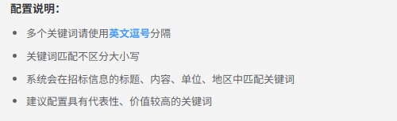
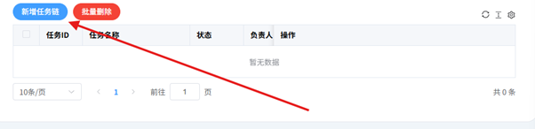
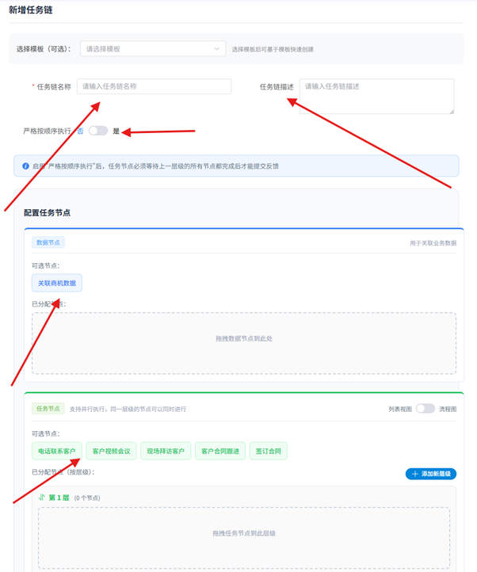
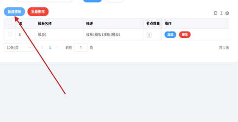
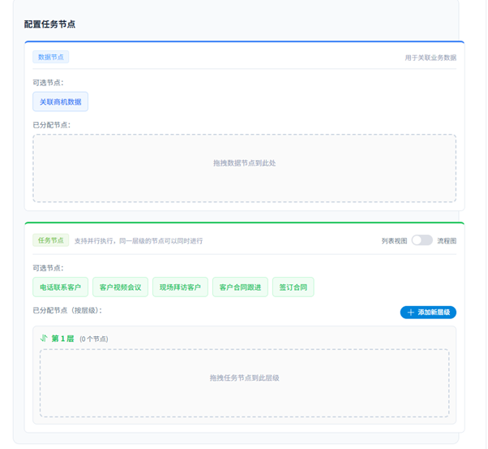
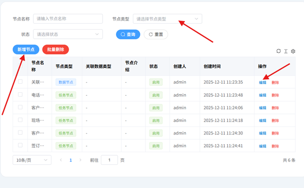

------操作指南------

*版本：V1.0（开发中）*

# ⚠️ 使用前必读

+-----------------------------------------------------------------------+
| **❗重要提示❗**                                                      |
|                                                                       |
| **1. 本平台正在开发中，部分功能可能无法使用**                         |
|                                                                       |
| **2. 请严格按照本说明书的步骤操作**                                   |
|                                                                       |
| **3. 看到\"禁止操作\"的地方，绝对不要点击！**                         |
|                                                                       |
| **4. 遇到问题不要乱点，请联系技术支持**                               |
|                                                                       |
| **5. 保存好您的登录密码，不要告诉其他人**                             |
+=======================================================================+
+-----------------------------------------------------------------------+

## 📖 如何使用本手册

-   看到\"🟢 可以操作\"的地方，按照步骤放心操作

-   看到\"🔴 禁止操作\"的地方，千万不要点击

-   看到\"⚠️ 注意\"的地方，请仔细阅读

-   看到\"🚧 开发中\"的地方，表示功能还没做好

-   如果鼠标变成了小手👆的形状，说明可以点击

# 一、工作台（驾驶舱）

**工作台是您每天使用最多的地方，就像汽车的驾驶舱一样，所有重要信息都在这里！**

## 1.1 行业线索和新闻动态

这里会自动收集您所在行业的最新信息和商业机会。

**🟢 可以这样操作：**

1.  点击\"查看全部\"按钮，可以看到所有收集的信息{width="5.229896106736658in"
    height="2.5836942257217848in"}

2.  当鼠标移到某条信息上，如果鼠标变成小手👆形状，就可以点击打开查看详情

**⚠️ 注意事项：**

-   不是所有信息都能点击，只有鼠标变成小手的才能点

-   打开的链接会跳转到外部网站，看完记得关闭

## 1.2 AI对练模块（快捷入口）

这里是AI对练的快速入口，可以直接开始常用的ai虚拟实战训练。

**💡 小提示：**

-   这里只是快捷入口，完整的AI对练列表在左侧菜单的AI对练中

## 1.3 常用智能体

常用智能体都在这里，也是智能体快捷入口，完整的智能体在左侧菜单应用中

## 1.4 CRM待办事项

这里显示您需要跟进的所有任务，和待跟进线索，并且会有接下来的信息以及跟进记录。这些内容会尽量确保每天的事情没有遗漏，并且督促您完成每天的任务\
{width="6.268055555555556in"
height="1.9368055555555554in"}

## 1.5 AI使用统计

这里统计最近30天您使用AI的情况，帮助您了解自己的使用习惯。

{width="6.268055555555556in"
height="2.9308169291338584in"}\
并且可以看到经常使用的应用top10\
{width="6.268055555555556in"
height="1.2006944444444445in"}

# 二、CRM管理（客户关系管理）

**CRM管理帮您管理所有客户信息，跟进销售进度，不错过任何商机！**

## 2.1 企业信息

管理所有的企业客户基本信息。需要自己根据行业/机会需求创建企业信息。

**⚠️ 注意事项：**

-   删除企业前请三思！删除后无法恢复

-   批量删除时，务必检查清楚选中的企业

## 2.2 待办事项

这里和工作台的待办事项是联动的，内容完全一样，会有更详细的线索信息。

## 2.3 商机关键词

设置关键词后，系统会自动帮您找到相关的商机信息！会有配置说明说。\
{width="5.209060586176728in"
height="1.5939720034995626in"}

## 2.4 信息动态

查看您所需要的行业信息和动态。\
根据关键词搜索，可以筛选作者，行业分类以及根据时效性筛选是时效范围。\
{width="6.017666229221347in"
height="2.2754593175853017in"}

## 2.5 客户管理

**这是CRM的核心功能！责任到人制度，每个客户分配到个人。并且按需求，分配客户级别，从而方便管理。**

**⚠️ 重要提醒：**

-   客户转移后，原负责人将失去对该客户的管理权限

-   转移记录会被保存，用于责任追踪

## 2.6 商机管理

系统根据您设置的关键词，自动找到的真实商机！

## 2.7 任务走访

记录您对商机的跟进情况，让团队了解进展。也对自己的销售流程走到哪里有个记录。

## 2.8 线索管理

管理所有的销售线索，把线索转化为客户！

# 三、AI对练

**通过虚拟场景实战，提升您的业务能力和沟通技巧！**

## 3.1 什么是AI对练

AI对练就像一个虚拟的客户或同事，和您进行模拟对话练习。

{width="6.092104111986002in"
height="4.431725721784777in"}\
根据箭头方向，可以切换自己需要的应用，开启新的对话，以及ai给予的提示。

# 四、应用/应用组

**管理所有的AI智能助手，让它们为您服务！**

## 4.1 应用管理

**🔴 禁止操作：**

-   不懂技术的话，不要乱改API配置

-   不要删除正在使用的应用

一般来讲直接到我的应用/我的应用组直接使用即可，如果有需求需要创建/使用自己的API/应用模型，按需求创建和分配即可。\
{width="1.9377701224846895in"
height="2.7191294838145232in"} {width="3.6679297900262466in"
height="2.707668416447944in"}\
{width="5.87194772528434in"
height="3.4056780402449696in"}

组合应用根据不同的需求组合智能体即可。

# 五、文档库

5.1 文档管理/分类管理\
\
文档管理中，可以上传文档，并且根据行业不同，分配到不同的类别中，根据需求同步到知识库中。\
分类管理是管理不同的行业，有通用信息，以及行业精准信息，并且根据行业的不同来填充知识库以及行业准则。\
{width="6.268055555555556in"
height="1.3819444444444444in"}\
🚧 开发中

#  六、知识库

知识库是AI智能体的\"大脑\"，存储所有行业知识！\
根据不同的文档，行业，描述来分类归档知识体系，并且不同的用户可以根据不同的权限来调用这个文档内容。

# 七、任务链

**任务链帮您把复杂工作分解成清晰的步骤，一步步完成！**

## 7.1 什么是任务链

**简单来说：**

任务链就是把一个大任务，分成一个个小步骤，像流水线一样，一步一步完成。

**📝 生活中的例子：**

做一顿饭的任务链：买菜 → 洗菜 → 切菜 → 炒菜 → 装盘 → 上菜

每一步都要完成，才能进行下一步，最后才能吃到饭。

**📝 工作中的例子：**

客户签约的任务链：

获取线索 → 初次联系 → 了解需求 → 产品演示 → 报价 → 谈判 → 签订合同 →
售后跟进

## 7.2任务链的两个重要概念

**7.21 数据节点 VS 任务节点**

+-------------------------------------+--------------------------------+
| **数据节点**                        | **任务节点**                   |
+=====================================+================================+
| **存储信息的节点**                  | **需要执行的工作**             |
|                                     |                                |
| 比如：                              | 比如：                         |
|                                     |                                |
| • 客户信息                          | • 电话联系客户                 |
|                                     |                                |
| • 产品资料                          | • 视频会议演示                 |
|                                     |                                |
| • 合同模板                          | • 上门拜访                     |
|                                     |                                |
| • 报价单                            | • 签订合同                     |
|                                     |                                |
| *作用：提供工作需要的资料*          | *作用：实际要做的事情*         |
+-------------------------------------+--------------------------------+

**7.22串联 VS 并联\
串联（一个接一个）：**

就像排队，前一个人办完，下一个人才能办。

例如：必须先打电话联系客户，客户同意了，才能安排上门拜访。

**并联（同时进行）：**

就像多个窗口同时办事，可以一起做。

例如：准备报价单、准备产品资料、准备合同模板，这三件事可以同时做

## 7.3任务链管理（如何创建任务链） {width="6.268055555555556in" height="1.5229166666666667in"} {width="6.268055555555556in" height="7.526388888888889in"}

### 7.31需要填写的内容：

+-------------------+--------------------------------------------------+
| **任务名称**      | 要简洁清楚，一看就知道是什么任务                 |
|                   |                                                  |
|                   | *示例：客户签约流程、新员工入职流程*             |
+===================+==================================================+
| **任务描述**      | 详细说明这个任务链是干什么用的                   |
|                   |                                                  |
|                   | *示例：从获取客户线索到最终签约的完整流程*       |
+-------------------+--------------------------------------------------+
| *                 | 选\"是\"：必须一步一步来，不能跳步               |
| *严格按顺序执行** |                                                  |
|                   | 选\"否\"：可以灵活调整顺序                       |
+-------------------+--------------------------------------------------+

###  7.32设计任务流程（两种方法）

**方法一：使用现成模板（推荐新手）**

1.  点击\"选择模板\"按钮

2.  从模板库中选择适合您行业的模板

3.  点击\"应用模板\"

4.  根据需要微调（可选）

5.  点击\"保存\"

> **方法二：使用现成模板（适合有经验的客户）**

根据自己的需求自由添加数据节点以及任务节点，并且可以根据自己的需求分离层级，使任务完美契合自己的需求。

### 7.33 节点管理以及模板管理

###  客户根据自己的需求来新增节点，并且分配不同的模板。 {width="5.157043963254593in" height="2.6524682852143484in"} {width="6.268055555555556in" height="5.759722222222222in"} 根据节点信息来创建模板。{width="6.268055555555556in" height="3.8819444444444446in"}  7.34 我的任务

{width="6.268055555555556in"
height="3.338888888888889in"}\
这个面板可以清晰的任务名称，谁去负责，并且有进度反馈。\
点开进度反馈之后有基本的任务信息，并且有跟进流程。\
如果查看的是查看报告，那么会有个任务总结，并且有基本任务信息，以及完成度统计。

{width="6.268055555555556in"
height="6.665277777777778in"}

在箭头处可以导出自己的任务报告，从而更方便的总结经验。

#      八、权限管理

**管理人员和权限，确保系统安全！**

+-----------------------------------------------------------------------+
| **⚠️ 特别提醒 ⚠️**                                                    |
|                                                                       |
| **权限管理非常重要！操作失误可能导致严重后果！**                      |
|                                                                       |
| **如果您不是管理员，请不要随意操作此模块！**                          |
+=======================================================================+
+-----------------------------------------------------------------------+

# 九、系统管理

**系统底层配置，请谨慎操作！**

+-----------------------------------------------------------------------+
| **🚨 严重警告 🚨**                                                    |
|                                                                       |
| **系统管理模块涉及系统核心配置**                                      |
|                                                                       |
| **非专业技术人员请勿操作！**                                          |
+=======================================================================+
+-----------------------------------------------------------------------+

## 9.3 定时任务

***🚧 功能开发中***

*此功能正在开发中，暂时无法使用。*

# 附录：常见问题解答

## Q1：

# 联系我们

+-----------------------------------------------------------------------+
| **遇到问题，请及时联系我们！**                                        |
|                                                                       |
| 📧 技术支持邮箱：                                                     |
|                                                                       |
| 📞 技术支持电话：                                                     |
|                                                                       |
| *我们会尽快为您解决问题！*                                            |
+=======================================================================+
+-----------------------------------------------------------------------+

*------ 说明书结束 ------*

*祝您使用愉快！*
